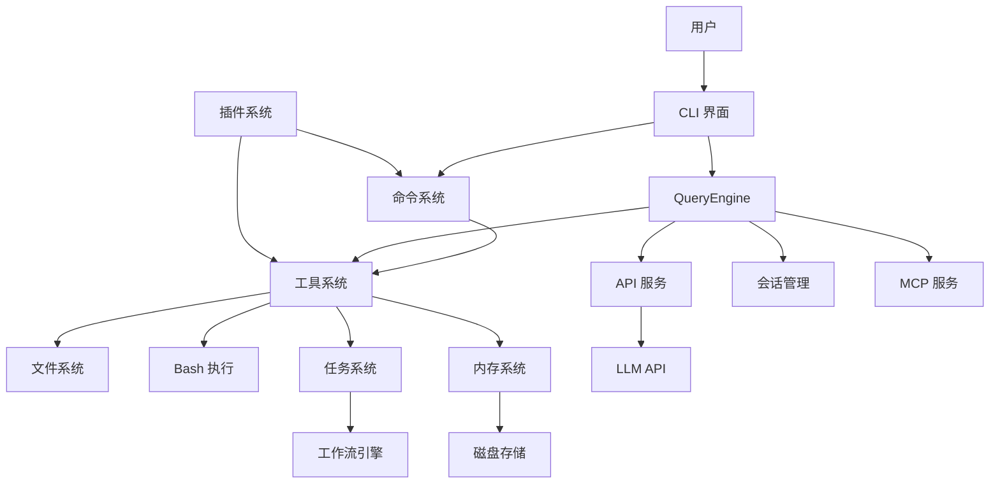

# FuPaw 项目架构设计说明书

## 1. 项目概述

FuPaw 是一个基于 AI 助手的代码开发工具，提供了丰富的功能和工具，帮助开发者更高效地进行代码开发、分析和管理。项目采用 TypeScript 开发，使用 Commander.js 构建命令行用户界面，集成了多种服务和工具系统。

### 1.1 核心功能

- AI 代码助手功能
- 命令行界面和交互体验
- 工具系统（文件操作、Bash 执行、代码分析、任务管理、内存管理等）
- 会话管理和历史记录
- 任务系统（支持复杂任务处理、工作流、子代理）
- 内存系统（三层内存管理、熔断机制）
- MCP（Model Context Protocol）集成
- 多平台支持（macOS、Windows、Linux）

## 2. 架构设计

### 2.1 整体架构

FuPaw 采用分层架构设计，主要包括：

1. **核心层**：包含 QueryEngine、Tool 系统、命令系统、Task 系统和 Memory 系统
2. **服务层**：提供 API 调用、MCP 集成、分析等服务
3. **界面层**：基于 Commander.js 的命令行用户界面
4. **工具层**：各种内置工具和插件
5. **基础设施层**：配置管理、安全存储、文件系统等

### 2.2 核心模块

#### 2.2.1 QueryEngine

QueryEngine 是项目的核心引擎，负责处理 LLM API 调用、会话管理和工具调用循环。

- **功能**：
  - 管理对话的查询生命周期和会话状态
  - 处理流式响应和工具调用循环
  - 实现思考模式、重试逻辑和令牌计数
  - 管理会话历史和状态持久化

- **关键组件**：
  - `submitMessage()`：处理用户输入并启动查询
  - `processUserInput()`：处理用户输入和命令
  - 会话状态管理：消息、文件缓存、使用情况等

#### 2.2.2 Tool 系统

Tool 系统定义了工具的基础类型和接口，支持各种工具的注册和执行。

- **功能**：
  - 定义工具的输入模式和权限模型
  - 提供工具调用的上下文和进度状态
  - 支持工具的渲染和结果处理

- **关键组件**：
  - `Tool` 类型：定义工具的接口和方法
  - 工具权限检查和验证
  - 工具结果渲染和处理

- **内置工具**：
  - `FileReadTool`：读取文件内容
  - `FileWriteTool`：写入文件内容
  - `BashTool`：执行 Bash 命令
  - `TaskCreateTool`：创建和管理任务
  - `MemoryTool`：管理内存系统

#### 2.2.3 任务系统 (Task System)

任务系统支持复杂任务处理、工作流和子代理管理。

- **功能**：
  - 支持多种任务类型（本地 Bash、本地代理、远程代理、工作流）
  - 任务生命周期管理（创建、启动、运行、完成、失败、终止）
  - 工作流步骤依赖管理
  - 任务状态持久化和通知

- **关键组件**：
  - `TaskState`：任务状态类型定义
  - `TaskRegistry`：任务注册和管理
  - `LocalShellTask`：本地 Bash 任务
  - `LocalAgentTask`：本地代理任务
  - `LocalWorkflowTask`：本地工作流任务

#### 2.2.4 内存系统 (Memory System)

内存系统提供三层内存管理和熔断机制。

- **功能**：
  - 三层内存管理（short、medium、long）
  - 内存持久化到磁盘
  - 自动过期清理
  - 熔断机制防止服务故障

- **关键组件**：
  - `MemoryManager`：内存管理器
  - `MemoryItem`：内存项类型
  - `CircuitBreaker`：熔断机制
  - 内存查询和过滤

#### 2.2.5 命令系统

命令系统管理所有斜杠命令的注册和执行。

- **功能**：
  - 注册和管理所有命令
  - 处理命令的执行和参数解析
  - 支持条件导入和环境特定命令

- **关键组件**：
  - `getCommands()`：获取可用命令列表
  - 命令分类：Prompt 命令、Local 命令、LocalJSX 命令
  - 动态技能发现和加载

#### 2.2.6 前端界面

基于 Commander.js 的命令行用户界面，提供交互式体验。

- **功能**：
  - 渲染消息和工具结果
  - 处理用户输入和键盘事件
  - 提供命令行界面和交互元素

- **关键组件**：
  - `cli.ts`：命令行界面主入口
  - 命令解析和执行
  - 消息渲染和格式化

### 2.3 数据流

1. **用户输入流**：
   - 用户输入 → CLI 界面 → processUserInput → 命令处理/工具调用

2. **查询处理流**：
   - 用户输入 → QueryEngine.submitMessage → API 调用 → 流式响应 → 工具调用循环 → 结果渲染

3. **工具调用流**：
   - LLM 生成工具调用 → 权限检查 → 工具执行 → 结果处理 → 继续查询循环

4. **任务处理流**：
   - 任务创建 → 任务注册 → 异步执行 → 状态更新 → 通知发送

5. **内存管理流**：
   - 内存添加 → 持久化存储 → 过期检查 → 自动清理

6. **会话管理流**：
   - 会话创建 → 消息积累 → 历史记录保存 → 会话恢复

### 2.4 组件关系



## 3. 核心功能模块

### 3.1 QueryEngine

QueryEngine 是整个系统的核心，负责管理查询生命周期和会话状态。

- **会话管理**：
  - 维护会话消息历史
  - 处理会话状态持久化
  - 支持会话恢复和继续

- **查询处理**：
  - 构建系统提示和上下文
  - 调用 LLM API 并处理响应
  - 管理工具调用循环
  - 处理错误和重试逻辑

- **状态管理**：
  - 跟踪 API 使用情况和成本
  - 管理文件缓存和状态
  - 处理权限和安全检查

### 3.2 Tool 系统

Tool 系统提供了一种标准化的方式来定义和执行各种工具。

- **工具类型**：
  - 文件操作工具（Read、Write、Edit）
  - Bash 执行工具
  - 代码分析工具
  - 任务管理工具（TaskCreateTool）
  - 内存管理工具（MemoryTool）
  - MCP 工具
  - 技能工具

- **工具接口**：
  - `call()`：执行工具逻辑
  - `description()`：生成工具描述
  - `validateInput()`：验证输入参数
  - `checkPermissions()`：检查权限
  - `renderToolResultMessage()`：渲染工具结果

- **权限系统**：
  - 基于输入的权限检查
  - 自动模式和手动模式
  - 权限缓存和决策记录

### 3.3 任务系统

任务系统支持复杂任务处理、工作流和子代理管理。

- **任务类型**：
  - `LocalShellTask`：本地 Bash 任务
  - `LocalAgentTask`：本地代理任务
  - `RemoteAgentTask`：远程代理任务
  - `LocalWorkflowTask`：本地工作流任务

- **任务生命周期**：
  - `pending`：待执行
  - `running`：运行中
  - `completed`：已完成
  - `failed`：失败
  - `killed`：被终止

- **工作流支持**：
  - 多步骤任务定义
  - 步骤依赖管理
  - 结果传递和引用
  - 错误处理和回滚

- **任务管理**：
  - 任务注册和注销
  - 状态更新和通知
  - 任务输出管理
  - 任务终止和清理

### 3.4 内存系统

内存系统提供三层内存管理和熔断机制。

- **内存层级**：
  - `short`：短期内存（1小时过期，1MB限制）
  - `medium`：中期内存（24小时过期，10MB限制）
  - `long`：长期内存（30天过期，100MB限制）

- **内存管理**：
  - 内存添加和查询
  - 自动过期清理
  - 大小限制管理
  - 磁盘持久化

- **熔断机制**：
  - `closed`：正常状态
  - `open`：熔断状态（服务不可用）
  - `half-open`：半开状态（尝试恢复）
  - 自动恢复和手动重置

- **查询功能**：
  - 文本搜索
  - 标签过滤
  - 类型过滤
  - 层级过滤
  - 相关性排序

### 3.5 命令系统

命令系统管理所有斜杠命令的注册和执行。

- **命令类型**：
  - Prompt 命令：生成提示并获取 LLM 响应
  - Local 命令：在本地执行操作
  - LocalJSX 命令：执行并渲染 JSX 组件

- **命令发现**：
  - 内置命令注册
  - 插件命令加载
  - 动态技能发现

- **命令执行**：
  - 参数解析和验证
  - 命令执行和结果处理
  - 错误处理和用户反馈

### 3.6 前端界面

基于 Commander.js 的命令行用户界面，提供交互式体验。

- **界面组件**：
  - 消息列表和渲染
  - 文本输入和自动完成
  - 命令行提示和帮助
  - 工具结果可视化

- **交互功能**：
  - 键盘快捷键和命令
  - 文本选择和复制
  - 会话管理和导航
  - 主题和样式定制

- **性能优化**：
  - 异步加载和处理
  - 终端大小适配

## 4. 服务层

### 4.1 API 服务

处理与 LLM API 的通信和管理。

- **功能**：
  - API 调用和响应处理
  - 错误处理和重试逻辑
  - 使用情况跟踪和成本计算
  - 会话管理和上下文构建

- **集成**：
  - Anthropic API
  - AWS Bedrock
  - Google Vertex AI
  - 本地 LLM 服务（Ollama）
  - 其他 LLM 提供商

### 4.2 MCP 服务

管理 Model Context Protocol 集成，支持外部工具和服务。

- **功能**：
  - MCP 服务器连接和管理
  - 工具发现和注册
  - 权限管理和验证
  - 资源管理和缓存

- **集成**：
  - 官方 MCP 服务器
  - 自定义 MCP 服务器
  - FuPaw MCP 配置

### 4.3 分析服务

提供使用情况分析和遥测。

- **功能**：
  - 事件跟踪和记录
  - 使用情况统计和报告
  - 性能监控和分析
  - 功能标志管理

- **工具**：
  - GrowthBook：功能标志和实验
  - 自定义遥测系统
  - 性能分析工具

## 5. 目录结构

```
src/
├── backend/
│   ├── apiService.ts       # API 服务
│   ├── queryEngine.ts      # 查询引擎
│   └── toolSystem.ts       # 工具系统
├── config/
│   └── config.ts           # 配置管理
├── frontend/
│   └── cli.ts              # CLI 界面
├── memory/
│   ├── types.ts            # 内存类型定义
│   └── MemoryManager.ts    # 内存管理器
├── tasks/
│   ├── types.ts            # 任务类型定义
│   ├── framework.ts        # 任务框架
│   ├── LocalShellTask.ts   # 本地 Bash 任务
│   ├── LocalAgentTask.ts   # 本地代理任务
│   └── LocalWorkflowTask.ts # 本地工作流任务
├── tools/
│   ├── TaskCreateTool.ts   # 任务创建工具
│   └── MemoryTool.ts       # 内存管理工具
├── index.ts                # 主入口
docker/
├── Dockerfile              # Docker 配置
ccAnalysis/                 # 分析文档
├── PROJECT_ANALYSIS.md
├── COMPLEX_TASK_PROCESSING.md
├── TASK_LIFECYCLE.md
└── ...
```

## 6. 部署方案

### 6.1 Docker 配置

- **Dockerfile**：定义容器构建
- **docker-compose.yml**：配置服务栈
- **环境变量**：配置 API 密钥和设置

### 6.2 服务栈

- **后端**：Node.js 服务
- **前端**：命令行界面
- **存储**：本地文件系统
- **网络**：API 调用和外部服务

### 6.3 部署步骤

1. **构建容器**：`docker build -t fupaw-poc .`
2. **运行容器**：`docker run -it fupaw-poc`
3. **配置 API 密钥**：设置环境变量
4. **启动服务**：初始化并运行 POC 项目

## 7. 技术栈

### 7.1 核心技术

- **TypeScript**：类型安全的 JavaScript 超集
- **Node.js**：JavaScript 运行时
- **Commander.js**：命令行解析
- **Zod**：模式验证

### 7.2 依赖库

- **@anthropic-ai/sdk**：Anthropic API 客户端
- **commander**：命令行解析
- **zod**：模式验证
- **chalk**：终端颜色
- **axios**：HTTP 客户端
- **dotenv**：环境变量管理

### 7.3 服务集成

- **Anthropic API**：LLM 服务
- **AWS Bedrock**：云 LLM 服务
- **Google Vertex AI**：云 LLM 服务
- **Ollama**：本地 LLM 服务
- **MCP**：Model Context Protocol

## 8. 总结

FuPaw 是一个功能丰富的 AI 代码助手工具，采用模块化、分层的架构设计。核心模块包括 QueryEngine、Tool 系统、任务系统、内存系统、命令系统和前端界面，通过服务层与外部 API 和服务集成。

项目基于核心设计理念，构建了一个简化版本，包含基本的查询处理、工具系统、任务系统、内存系统和命令行界面，并支持 Docker 部署。

未来的优化方向包括性能提升、安全性增强、可扩展性改进和用户体验优化，以构建一个更强大、更可靠的 AI 代码助手工具。
